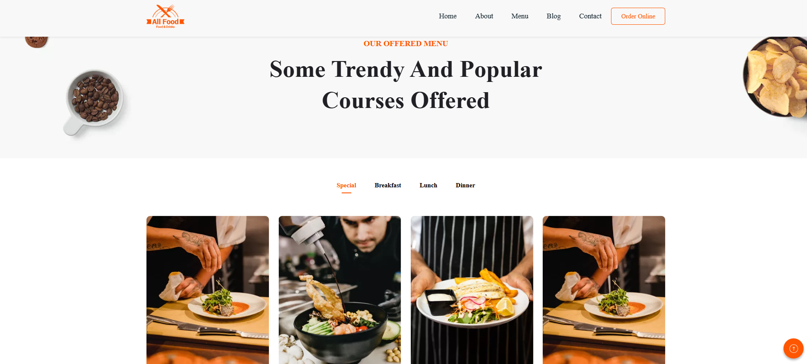
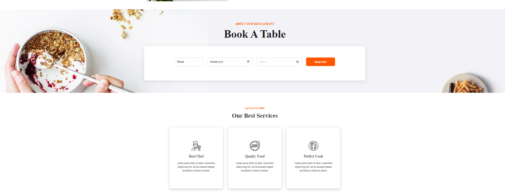

# allfood_project
React Build Website For Restaurant

# 🍴 AllFood – React Project  

This project is a React-based implementation of the **AllFood Template** provided at [Colorlib Preview](https://preview.colorlib.com/theme/allfood/index.html).  

The project has been customized and structured with modern React practices, including **React Router**, **component-based architecture**, and **data rendering**.  

---

## 🚀 Live Demo  
🔗 [View Deployed Project on Vercel](https://allfood-project.vercel.app/)  

---

## 📂 GitHub Repository  
🔗 [View Source Code on GitHub](https://github.com/Tapkir-Sahil/allfood_project)  

---

## 🛠️ Tech Stack  
- **React 18+**  
- **React Router DOM** for navigation  
- **Vite** for fast development build  
- **CSS / Bootstrap**  
- **Deployment:** Vercel  

---

## ✨ Features Implemented  
- 🔹 **Routing:** Implemented using React Router DOM.  
- 🔹 **Component-based Architecture:** Header, Footer, Navbar, and Pages split into reusable components.  
- 🔹 **Dynamic Rendering:** Data is passed via states and rendered using `.map()`.  
- 🔹 **Responsive Design:** Works across devices (desktop, tablet, mobile).  
- 🔹 **Deployed on Vercel** for production-ready hosting.  

---

## 📸 Screenshots  

### 🏠 Homepage  
  

### 📄 Offered Menu
  

### 📞 Book A Table
  

---

## ⚙️ Installation & Setup  

1. Clone the repository  
   ```bash
   git clone https://github.com/Tapkir-Sahil/allfood_project


## ⚙️ Install dependencies

- 🔹 npm install.
- 🔹 npm run dev.
- 🔹 http://localhost:5173/.

## 📂 Project Structure

```
allfood-project/

│── 📂 public/
│ ├── 📂 icons/ # Static icons
│ ├── 📂 restaurant_template/ # Template assets (images, etc.)
│ ├── 📂 screenshots/ # Project screenshots for README

│── 📂 src/
│ ├── 📂 assets/ # Images, fonts, static files (importable in React)
│ │ ├── 📂 images/

│ ├── 📂 components/ # Reusable UI components
│ │ ├── 📂 Home/ # Page-level components
│ │ │ └── 📄 Home.jsx
│ │ ├── 📂 About/
│ │ │ └── 📄 About.jsx
│ │ ├── 📂 Contact/
│ │ │ └── 📄 Contact.jsx
│ │ └── 📂 Menu/
│ │ └── 📄 Menu.jsx

│ ├── 🎨 index.css
│ ├── 📄 App.jsx # Main App with Router
│ ├── 📄 main.jsx # React entry point

│── 📄 index.html
│── 📄 .gitignore
│── 📄 package.json
│── 📄 README.md
│── ⚙️ vite.config.js

```